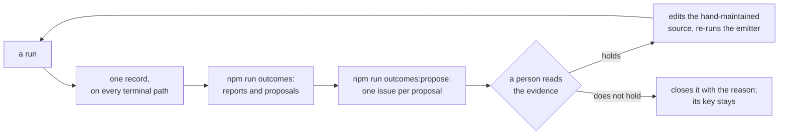

# asdlc-dry-run

**A shell repository: the layout, the tools and the guardrails for software delivery by AI agents
under a person's supervision, laid down from a starter kit, with no product code in it.** What is
worth reading here is the structure: where a rule lives, which check refuses what and at which
moment, how parallel agent sessions are kept apart, and how a supervised workflow records what it
did. Every gate runs green against the shell itself, and the places where a real subject goes are
marked (§ What is still a placeholder).

This page describes and points; it holds no rule. The rules an agent follows are in `CLAUDE.md`,
and the status of work is in `bd`. Where this page and a file it points at disagree, that file
wins and this page is corrected.

**On this page:** [Read in this order](#read-in-this-order) ·
[How it is laid out](#how-it-is-laid-out) · [The guardrails](#the-guardrails) ·
[Setup](#setup) · [Working here](#working-here) · [The npm scripts](#the-npm-scripts) ·
[The supervised workflow](#the-supervised-workflow-and-the-learning-loop) ·
[What is still a placeholder](#what-is-still-a-placeholder) ·
[Where to read next](#where-to-read-next) · [What runs automatically](#what-runs-automatically)

## Read in this order

1. This page, down to § The guardrails: what the repository is and how its parts fit.
2. `CLAUDE.md`, whole. It is written for agents, and it is also the shortest complete statement of
   how work is done here; every guardrail below is a rule there first.
3. `docs/README.md`: the documentation index and the conventions every document follows.
4. `dry-run/README.md`, when you reach the workflow: its layers, and where a new rule goes.
5. The `README.md` of whichever directory you are about to change. Each one is a thesis sentence
   and a table with one row per file.

## How it is laid out

Every directory that holds more than one file of a kind has its own `README.md`; this table is the
level above them.

| Path | What it holds |
|---|---|
| `CLAUDE.md` | The only home for a rule an agent must follow. `AGENTS.md` is one line pointing at it, so a second home never grows. |
| `.claude/` | What the agent harness loads at session start: `settings.json` (the plugins and the hook registrations, nothing else), the skills under `skills/`, the agents under `agents/`, and the template for a worktree's briefing. |
| `scripts/` | Single-file gates, and the scripts a git hook or an operator calls. Each refuses one thing, and its header says which incident it exists to prevent. |
| `scripts/hooks/` | The in-session hooks: the fastest tier of checks, run by the harness around an agent's tool calls. |
| `tools/` | Emitters and multi-file checks, one directory each, TypeScript run directly by Node: `citations/` (every pointer resolves), `outcomes/` (the learning loop), `pipeline/` (the graph of what is generated from what). |
| `dry-run/` | The supervised workflow's skeleton: its policy file, the schemas for its facts file and its run record, its tools, and the tests over its prompts. Its prompts live under `.claude/skills/dry-run*` and `.claude/agents/dry-run-*`. |
| `artifacts/` | Generated output. Nothing here is edited by hand; each file names the emitter that wrote it, and a correction goes into that emitter's hand-maintained source. |
| `docs/` | What a person reads: the decision register (`decisions.md`), the pipeline graph in prose (`pipeline.md`), the retained prompt reviews, and what has been retired. |
| `count-index.md` | Every count that more than one file restates, under a `CNT-*` key, with the source it re-derives from. |
| `.beads/` | The configuration of `bd`, the issue tracker. Its database syncs through the git remote and is never committed; `bd bootstrap` hydrates it. |
| `lefthook.yml` | The git-hook tiers: which gate runs at commit and at push, each with the glob that scopes it and a note of its measured cost. `lefthook-windows.yml` is a per-machine override. |
| `.github/workflows/verify.yml` | The slowest tier: every gate that reads only committed files, on every pull request and every push to `main`. |
| `.devcontainer/` | A container that needs nothing from the network at create time. |
| `KIT-CHECKLIST.md` | What the starter kit's bootstrap laid down, step by step, and what is still to adapt. Deleted once it is worked through. |

Some paths appear only on a working machine and are gitignored, each with its reason in
`.gitignore`: `.scratch/` (commit messages, pull-request bodies and tracker notes, passed to tools
by file), `.dry-run/` (one directory per workflow run), `.claude/worktrees/` (one checkout per
parallel agent), `.worktree/` (a worktree's rendered briefing), `.claude/settings.local.json`
(machine-specific permissions) and `lefthook-local.yml`.

Every file is one of three kinds: hand-maintained source, a hand-authored decision record (JSON
that emitters read and nothing writes) or generated output under `artifacts/`
(`CLAUDE.md` § Three kinds of file, and never a fourth). Knowing which kind you are looking at
tells you whether to edit it.

## The guardrails

The same checks run at four latencies, and a slower tier never trusts a faster one: in-session
hooks, pre-commit, pre-push, and `.github/workflows/verify.yml` (`CLAUDE.md` § The gate ladder).
Where a check runs is decided by what it reads. § What runs automatically, at the foot of this
page, lists each one by its trigger.

Each row below is a failure this repository is built to refuse, what refuses it, and the home of
the rule. The third column wins over the first two.

| What it stops | What enforces it | The rule's home |
|---|---|---|
| A rule with two homes, one of them stale; a rule kept in an agent's memory store | The citations gate's memory rule (`tools/citations/memory.ts`), and review | `CLAUDE.md` § Rules for agents live in tracked files, and nowhere else |
| A hand edit to generated output | `scripts/hooks/block-generated-edit.mjs` in session, `scripts/assert-not-hand-edited.mjs` at commit, and each emitter's `:check` twin at push and in CI | `CLAUDE.md` § The script suffix contract |
| A green run that ran nothing | `npm run gates` forces the full suite; `check:jobs` refuses a gate no job runs unless it is declared, with its reason | `CLAUDE.md` § The gate ladder |
| A gate that still passes with its guard deleted | Every gate's `:selftest`: one break per case, the refusal's reason asserted, one undoctored control | `CLAUDE.md` § Standing rules for prompts and gates |
| An agent in a worktree pushing to, switching to or rewriting a protected branch | `scripts/hooks/guard-git.mjs`, and the worktree hooks that provision only through `scripts/new-worktree.sh` | `CLAUDE.md` § Git workflow |
| A figure restated from memory that has since moved | `counts:check` re-derives every keyed count from its source | `count-index.md` § How to use it |
| A pointer to a file or a section that is gone | `citations:check`, over every tracked text file | `CLAUDE.md` § Citations |
| A recorded decision argued again, or a register whose summary drifts from its entries | `check:register` | `CLAUDE.md` § Decisions live in the register |
| Work tracked in a checklist or a status table, or an issue that does not say where its work lands | `beads:check`, and the rule that status lives only in `bd` | `CLAUDE.md` § The task store |
| A generated artifact left stale after its input moved | `pipeline:check` and `pipeline:stale:check` | `docs/pipeline.md` § The two gates |
| A prompt that loses a load-bearing sentence, names a tool that does not exist or states a constant of its own | `dry-run:test`: validators over the prompts' structure, not over a model's output | `dry-run/README.md` § Tests |
| A program that rewrites its own instructions from what it observed | `outcomes:propose` only files issues; a person promotes one by editing the source | `CLAUDE.md` § A program proposes; only a person promotes |
| A chained shell command whose failing step cannot be told apart, or a workaround for a refused command | Convention, and a `RUN THESE YOURSELF` block at the end of the agent's report | `CLAUDE.md` § Bash command style |

Two habits make the rest legible. Every script opens with a header saying what it checks, **the
failure it exists to prevent**, how to invoke it and what it needs, so read the header before
weakening a gate that is in your way. And every decision nobody should re-argue is a numbered entry
in `docs/decisions.md`, amended and never rewritten.

## Setup

Numbered per platform. Every step is a command to run or a file to write, in order; a step that
does not apply to your platform is absent from its list, not marked optional.

<!-- kit 4.1-5 · ADAPT: these are the steps the kit's own files need. Add yours (a second checkout,
     a token, a toolchain) at the position where a fresh machine needs them, on every platform's
     list, and re-run the lists on a fresh machine before trusting them. Every item is written
     `1.` so each list stays numbered for any selection of the kit; number them literally once
     yours are settled. Delete this comment when done. -->

### macOS and Linux

1. Install git, and Node 22.18 or newer (`package.json` `engines` is the floor; it runs the
   TypeScript tools here directly, so nothing else is needed to run a gate).
1. Install `bd`, the tracker's CLI, and check that `bd --version` answers.
1. Clone, then `npm ci`. The hook runner's install script writes the git hooks; if your package
   manager blocks install scripts, run `npx lefthook install` once.
1. Set `sync.remote` in `.beads/config.yaml` if it still holds a placeholder, then `bd bootstrap`.
   Never `bd init`: it creates a new tracker instead of hydrating this one, and takes over the git
   hooks directory.
1. Run `npm run gates` and read a green suite before the first change. Never the bare hook
   runner: with nothing to push it skips every job and exits 0 (`CLAUDE.md` § The gate ladder).

### Windows, native

1. Install git, and Node 22.18 or newer.
1. Install `bd`, the tracker's CLI, and check that `bd --version` answers from the shell you will
   work in.
1. Clone, then `npm ci`. If install scripts are blocked, run `npx lefthook install` once.
1. Copy `lefthook-windows.yml` to `lefthook-local.yml` and do not commit the copy. Without it the
   pre-push suite finishes every job and then never returns; the file's header has the reason.
1. Set `sync.remote` in `.beads/config.yaml` if it still holds a placeholder, then `bd bootstrap`.
   Never `bd init`.
1. Run `npm run gates` and read a green suite before the first change.

A clone that is built on Windows is not also built from Linux (a container, WSL): `node_modules`
holds platform-native binaries. Use one clone per platform.

### Dev container

1. On the host, run `claude` and `gh` once each, so the files the container bind-mounts exist.
1. Clone, open the folder in VS Code, and choose "Reopen in Container".
1. Wait for the first build. `.devcontainer/entrypoint.sh` then runs the install, the git hooks and
   the tracker's hydration on every start, and warns rather than fails; read its output once.
1. Run `npm run gates` and read a green suite before the first change.

`.devcontainer/README.md` has the reasons and the mounts.

## Working here

| To do this | Use this | Notes |
|---|---|---|
| See what is ready to be worked | `bd ready` | The queue. There is no status table anywhere else, by rule. |
| Have an agent work one issue end to end | the `bead` skill | Verifies the issue's premise first, then claims, implements, gates, opens the pull request and closes on green. |
| Have agents work the ready issues in parallel | the `fan-out-work` agent | One fresh agent per lane, each in its own worktree, integrated on the dispatcher's branch. |
| Research a topic before changing anything | the `explore` skill | Assumptions and guesses first, then an inventory of evidence with no recommendations. |
| Draft what a person must do for an issue an agent cannot finish | the `human-plan` skill | |
| Get the last reply, or one term, explained in plainer terms | `/eli5 [term or topic]` | Supplies the background the reply assumed; simplifies the wording, never the facts, and changes nothing. |
| Add, rename or remove an npm script | the `add-npm-script` skill | It keeps § The npm scripts below, the hook runner and CI in step. |
| Retire a file | the `retire-asset` skill | A register decision with a checklist, not a tidy-up (`docs/retired/README.md`). |
| Start a supervised workflow run | `/dry-run <item>` | Only a person can; the skill cannot be invoked by a model. |
| Make a worktree by hand | `scripts/new-worktree.sh <task-ref> <slug>` | From the primary checkout. It cuts `agent/<name>` from `origin/main`; `npm ci` is the first command inside. |
| Check your work before a pull request | `npm run gates` | Then fetch, rebase onto `origin/main`, and run it again. |
| Improve a prompt after running it | the `continuous-prompt-improvement` agent | The review is kept under `docs/prompt-reviews/`, never beside the prompt. |

## The npm scripts

Every script in `package.json`, one sub-section per prefix. A name of the form `<group>:<verb>` is
public: the bare name writes the artifact, `:check` re-derives it and writes nothing, `:selftest`
proves the gate refuses what it should (`CLAUDE.md` § The script suffix contract). The **Gate**
column is read off `lefthook.yml` and `.github/workflows/verify.yml`; where it disagrees with
them, they win.

### beads

| Script | What it does | Gate |
|---|---|---|
| `beads:check` | Refuses an open issue with no label naming where its work lands, and an issue citing an identifier that does not resolve here. It reads the tracker's database, which a fresh clone in CI does not have. | pre-push |

### check

| Script | What it does | Gate |
|---|---|---|
| `check:jobs` | Holds the hook runner's configuration, the CI workflow and `package.json` to each other: every job names a script that exists, and every script no job runs is declared with its reason. Without it a gate can be unwired and nothing says so. | pre-push + CI |
| `check:jobs:selftest` | The job cross-check, negative-tested. | pre-push + CI |
| `check:register` | Holds the register's status line, summary table and dates to its entries, in both directions. | pre-push + CI |
| `check:register:selftest` | The register gate, negative-tested. | pre-push + CI |

### citations

| Script | What it does | Gate |
|---|---|---|
| `citations:check` | Resolves every line and section pointer in every tracked text file, and refuses a pointer into a memory store this repository does not use. Without it a renamed heading leaves pointers that still look authoritative. | pre-push + CI |

### counts

| Script | What it does | Gate |
|---|---|---|
| `counts:check` | Re-derives every value in `count-index.md` from the source the index names for it. The table is updated from what it reports, never the reverse. | pre-push + CI |
| `counts:selftest` | The count-index gate, negative-tested. | pre-push + CI |

### dry-run

| Script | What it does | Gate |
|---|---|---|
| `dry-run:test` | Runs every validator over the workflow's prompts, policy file, schemas and tools, each in its own process, and fails when it discovers none. The two validators that need PowerShell skip by name where it is absent. | pre-push + CI |
| `dry-run:test:selftest` | Proves the runner itself: that it refuses a failure, a hang and an empty discovery. | pre-push + CI |

### gates

| Script | What it does | Gate |
|---|---|---|
| `gates` | The forced full pre-push suite, and the only way to run it by hand: the bare hook runner skips every job when there is nothing to push and exits 0. | |

### outcomes

| Script | What it does | Gate |
|---|---|---|
| `outcomes` | Reads every run record, re-serialises each to canonical bytes and writes the reports under `artifacts/outcomes/`, from the records and nothing else. | |
| `outcomes:check` | The same in memory, byte-compared with what is committed. | pre-push + CI |
| `outcomes:propose` | Files each proposal as an issue in `bd`, keyed by a hash so a closed proposal is never re-filed under new wording. Run by a person, `--dry-run` first; it reads and writes the tracker, so no tier runs it. | |
| `outcomes:record:selftest` | The record's validator and writer, negative-tested against one committed fixture per terminal path. | pre-push + CI |
| `outcomes:selftest` | The emitter and the filing step, negative-tested. | pre-push + CI |

### pipeline

| Script | What it does | Gate |
|---|---|---|
| `pipeline:check` | Holds the graph record (`tools/pipeline/graph.ts`) to the files it names, to the jobs that run its checks and to the prose page. | pre-push + CI |
| `pipeline:example` | Emits the worked example node's output. To delete, with the node, once a node of your own exists. | |
| `pipeline:selftest` | Both pipeline gates, negative-tested against a synthetic record. | pre-push + CI |
| `pipeline:stale` | Reports which node's declared inputs have moved since it stamped its output, with no exit code; `-- --verbose` says why a node is not covered. | |
| `pipeline:stale:check` | The same report as a gate. It runs no generator, so forgetting to regenerate is visible without regenerating. | pre-push + CI |

### worktree

| Script | What it does | Gate |
|---|---|---|
| `worktree:gc` | Removes checkouts nobody is using, and deletes an agent branch only on proof its content is in the trunk; `-- --dry-run` prints what it would do. | |
| `worktree:selftest` | The worktree hooks, the git guard and the branch sweep, negative-tested against a scratch repository it builds. | pre-push |

## The supervised workflow and the learning loop

`dry-run/` is a working skeleton of one workflow, with its subject left blank. One run takes one
work item from a read-only intake, through a single approval that names every mutation the run
will make, to a record. It may stop to ask a person only for a reason on an exhaustive list in
`dry-run/workflow-policy.json`; a build error or a failing test is not on it. `dry-run/README.md`
§ Layers says which file is read by whom and when, and § Where a rule goes says where to put a new
one.

Every run writes one record on every terminal path, complete, failed or blocked, to
`artifacts/outcomes/records/`, under `dry-run/run-outcome.schema.json`. The loop from there:

No run has happened here, so the reports under `artifacts/outcomes/` are the legal empty state and
each one says so.

## What is still a placeholder

The kit laid down what does not depend on a subject and marked the rest. This section says how to
find the marks, not how many remain: the work of clearing them is tracked in `bd`.

- `KIT-CHECKLIST.md`: an unticked box is a step the bootstrap could not do for you.
- A comment of the form `kit <section> · ADAPT` or `kit <section> · WRITE`, in any file, says what
  to write there and when to delete the comment. List the files that carry one with
  `git grep -l -E "kit [0-9.-]+ · (ADAPT|WRITE)"`.
- Text in `<angle brackets>` in `dry-run/README.md`, the entry skill and the contract page is the
  workflow's subject, which is yours.
- `docs/decisions.md` D-01 is dated 1970-01-01 because the kit could not know the adoption date.
- `count-index.md` § Rates and metrics has no row, and a metric with no row there is not reported.
- The pipeline graph holds one worked example node, to delete when a real one exists.

## Where to read next

| Path | What it is |
|---|---|
| `CLAUDE.md` | Read first. The only home for a rule an agent must follow here. |
| `docs/README.md` | The documentation index, and the conventions every document follows. |
| `docs/decisions.md` | The register of numbered decisions and risks. It wins a disagreement with any document. |
| `docs/pipeline.md` | Which generated artifact is built from which, and what to regenerate when something moves. |
| `count-index.md` | Every count describing the current measured state, under a key. |
| `scripts/README.md` | The single-file gates and git-job scripts, one row each. |
| `scripts/hooks/README.md` | The harness hooks, one row each. |
| `tools/README.md` | The emitters and multi-file checks, one row each. |
| `dry-run/README.md` | The supervised workflow: its layers, where a rule goes, and the tests over its prompts. |
| `.claude/README.md` | What the harness loads when a session starts here. |
| `.devcontainer/README.md` | The dev container's mounts, each with its failure mode. |
| `KIT-CHECKLIST.md` | What the kit laid down, and what is still to adapt. |

## What runs automatically

Nothing here needs remembering: each row fires on its trigger. The third column is the file that
wires it, and where this table and that file disagree, the file wins and the row is corrected.
The settings file registers `CNT-HOOKS` session hooks, and a session reads it once,
at its start: restart the session after changing it.

<!-- kit 4.1-5 · WRITE: one row per hook, job or workflow, added in the same change as its wiring.
     The kit lists only what it wired. -->

| Trigger | Effect | Wired in |
|---|---|---|
| `npm ci` | The hook runner's install script writes the git hooks below into `.git/hooks`. | `package.json` (`allowScripts`) |
| A session is about to run a Bash command | `scripts/hooks/guard-git.mjs` refuses, from a linked worktree, a git command against a protected branch or the worktree registry. | `.claude/settings.json` (`PreToolUse`) |
| A session is about to write or edit a file | `scripts/hooks/block-generated-edit.mjs` refuses an edit to generated output and names where the change belongs. | `.claude/settings.json` (`PreToolUse`) |
| A session has written or edited a file | `scripts/hooks/check-emitted-drift.mjs` re-runs the `:check` twin of any emitter whose input was just edited. | `.claude/settings.json` (`PostToolUse`) |
| A session stops | `scripts/hooks/gate-summary.mjs` runs the fastest gates and prints one verdict line. It never blocks the stop. | `.claude/settings.json` (`Stop`) |
| The harness creates a worktree | `scripts/hooks/worktree-create.mjs` provisions it through `scripts/new-worktree.sh`: `agent/<name>` off `origin/main`, with a rendered briefing. | `.claude/settings.json` (`WorktreeCreate`) |
| The harness removes a worktree | `scripts/hooks/worktree-remove.mjs` removes the checkout, keeps the branch, and sweeps merged agent branches. | `.claude/settings.json` (`WorktreeRemove`) |
| `git commit`, with a staged path under `artifacts/` | `scripts/assert-not-hand-edited.mjs` refuses a generated file that no longer matches its generator. | `lefthook.yml` (`pre-commit`) |
| `git commit`, `git checkout`, `git merge`, `git push` | The tracker's own git hooks, preserved as hook-runner jobs, so installing the hook runner does not turn the tracker's git integration off. | `lefthook.yml` (`pre-commit`, `prepare-commit-msg`, `post-checkout`, `post-merge`, `pre-push`) |
| `git push` | `beads:check` holds the open issues to the label and identifier rules. It reads the tracker's database, so it is not a `.github/workflows/verify.yml` step. | `lefthook.yml` (`pre-push`) |
| `git push` that changes `package.json`, `lefthook.yml`, `.github/workflows/verify.yml` or the gate | `check:jobs` and its selftest: every job names a script that exists, and every script no job runs is declared. | `lefthook.yml` (`pre-push`) |
| `git push` | `citations:check`: every line and section pointer in every tracked text file resolves. | `lefthook.yml` (`pre-push`) |
| `git push` that changes a hook or a worktree script | `worktree:selftest`: the worktree hooks and the guard, negative-tested. | `lefthook.yml` (`pre-push`) |
| `git push` | `counts:check` re-derives every value in `count-index.md` from the source the index names for it; `counts:selftest` holds the gate to its fixtures when the gate changes. | `lefthook.yml` (`pre-push`) |
| `git push` that changes the register, `CLAUDE.md` or the gate | `check:register` holds the register's header, summary table and dates to its entries, and its selftest holds the gate. | `lefthook.yml` (`pre-push`) |
| `git push` that changes the workflow, its prompts or `package.json` | `dry-run:test` runs the validators over the workflow's prompts; `dry-run:test:selftest` holds the runner when the runner changes. | `lefthook.yml` (`pre-push`) |
| `git push` that changes a record, the schema or the writer | `outcomes:record:selftest`: the record validator and writer, negative-tested against one fixture per terminal path. | `lefthook.yml` (`pre-push`) |
| `git push` that changes a record or the learning loop | `outcomes:check` rebuilds every report from the records and byte-compares it; `outcomes:selftest` holds the emitter and the filing step. Filing itself (`outcomes:propose`) is run by a person, never by a hook. | `lefthook.yml` (`pre-push`) |
| `git push` | `pipeline:check` holds the graph record to the files it names and to the prose page; `pipeline:stale:check` refuses an output whose stamp no longer matches its declared inputs; `pipeline:selftest` holds both gates. Neither carries a glob: the record's globs may name any file. | `lefthook.yml` (`pre-push`) |
| A pull request, or a push to `main` | Every gate that reads only committed files, cheapest first. It trusts none of the faster tiers. | `.github/workflows/verify.yml` |
| The dev container starts | `npm ci` when the lockfile moved, the git hooks, and the tracker's hydration; each step warns and carries on. | `.devcontainer/entrypoint.sh` |
